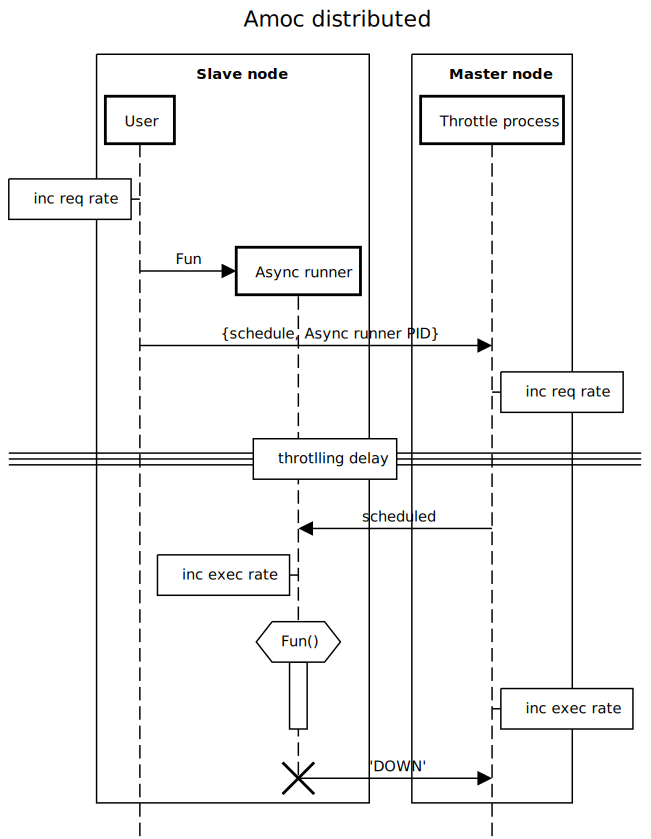

## Overview

Amoc throttle is a module that allows limiting number of users' actions per given interval, no matter how many users there are in a test.
It works in both local and distributed environment, allows for dynamic rate changes during a test and exposes metrics which show number of requests and executions.

Amoc throttle allows to set execution `Rate` per `Interval` or limit number of parallel executions when `Interval` is set to `0`.
Each `Rate` is identified with a `Name`.
Rate limiting mechanism is based on allowing execution in response to a request only when it would not exceed the given `Rate`.
Amoc throttle makes sure that given `Rate` per `Interval` is maintained on possibly equal level the whole time.
In other words, it will not create bursts of executions which would also technically result in the same rate in a given interval.
Because of that, it may happen that the actual `Rate` will be little lower then demanded.
It will however never be exceeded. 

## API

Functions provided by Amoc throttle:

- `start(Name, Rate)`, `start(Name, Rate, Interval)`, `start(Name, Rate, Interval, NoOfProcesses)` - functions starting throttle mechanism for a given `Name` with a given `Rate`.
They can also accept `Interval` (default is one minute) and ` NoOfProcesses` (default is 10).
`Name` is needed to identify the rate as one test can have different rates for different tasks.
`Interval` is given in milliseconds and can be changed to a different value for convenience or higher granularity.
It also accepts a special value of `0` which limits the number of parallel executions associated with `Name` to `Rate`.
- `send(Name, Msg)`, `send(Name, Pid, Msg)` - sends a given message `Msg` either to self or a given `Pid` when rate for `Name` allows for that.
May be used to schedule tasks.
- `send_and_wait(Name, Msg)` - sends and receives given message `Msg`.
Can be used to halt execution if we want a process to be idle when waiting for rate increase or other processes finishing their tasks.
- `run(Name, Fn)` - executes a given function `Fn` when it does not exceed rate for `Name`.
`Fn` is executed in a context of a new process spawned on the same node on which process executing `run/2` runs,
so call to `run/2` is non-blocking.
This function is used internally by both `send` functions and `send_and_wait/2`,
so all those actions will be limited to the same rate when called with the same `Name`.
- `pause(Name)` - pauses executions for given `Name` as if `Rate` was set to `0`.
Does not stop scheduled rate changes.
- `resume(Name)` - resumes executions for given `Name`, so `Rate` and `Interval` are set to the values they are supposed to
(which may be different to the ones set when `pause/1` was run).
- `change_rate(Name, Rate, Interval)` - sets `Rate` and `Interval` for `Name` according to the given values.
Can change whether Amoc throttle limits `Name` to parallel executions or to `Rate` per `Interval`, according to given `Interval` value.
- `change_rate_gradually(Name, LowRate, HighRate, RateInterval, StepInterval, NoOfSteps)` - allows to set a plan of gradual rate changes for a given `Name`.
Rate will be changed from `LowRate` to `HighRate` in series of consecutive steps.
`LowRate` does not need to be lower than `HighRate`, rates be changed downwards.
Rate at each step is calculated in relation to `RateInterval`, which can also be `0`.
Each step will take `StepInterval` time in milliseconds.
There will be `NoOfSteps` steps.
Be aware that at first rate will be changed to `LowRate` per `RateInterval` and this is not considered a step.
- `stop(Name)` - stops throttle mechanism for `Name`

## Examples

Typical use of Amoc throttle will look something like this:

```erlang
-module(scenario_with_throttle).

-export([init/0]).
-export([start/1]).

init() ->
    amoc_throttle:start(messages_rate, 100),        %% 100 messages per minute
    %% continue initialization
    ok.

start(Id) ->
    %% initialize user
    user_loop(Id),
    ok.
    
user_loop(Id) ->
    amoc_throttle:send_and_wait(messages_rate, some_message),
    send_message(Id),
    user_loop(Id).

```
Here a system should be under a continuous load of 100 messages per minute.
Note that if we used something like `amoc_throttle:run(messages_rate, fun() -> send_message(Id) end)` instead of `send_and_wait/2` the system would be flooded with requests.

A test may of course be much more complicated.
For example it can have load changing in time. 
A plan for that can be set up for the whole test in `init()`:
```erlang
init() ->
    %% init metrics
    amoc_throttle:start(messages_rate, 100),
    %% 9 steps of 100 increases in Rate, each lasting one minute
    amoc_throttle:change_rate_gradually(messages_rate, 100, 1000, 60000, 60000, 9),
    ok.

```
Normal Erlang messages can be used to schedule tasks for users by themselves or some controller process.
Below is a sketch of user's behaviour during a test.
It waits for messages in loop, and sends one after receiving message `{send_message, To}`.
Rate of messages sent during a test will not exceed a previously set one bound to the name `message_rate`.
Sending messages is scheduled in `set_up/1` function and in user loop if some arbitrary condition is met.
This models the behaviour common across load tests, when users respond only to some messages.
```erlang
set_up(Users) ->
    [User ! {send_message, To} || User <- Users, To <- Users].

user_loop() ->
    receive
        {send_message, To} -> 
            send_xmpp_message(To),
            user_loop();
        Message ->
            process_message(Message),
            user_loop()       
    end.

process_message(Message) ->
    case some_condition(Message) of
        true -> 
            To = get_sender(Message),
            amoc_throttle:send(message_rate, {send_message, To}); 
        false ->
            ok 
    end.

```

For a more comprehensive example please refer to the `throttle_test` scenario, which shows possible usages of Amoc throttle.

## How it works

### Module overview

- `amoc_throttle.erl` - provides an API for `amoc_throttle_controller`.
- `amoc_throttle_controller.erl` - a gen_server which is responsible for reacting to requests, and managing `throttle_processes`.
In distributed environment an instance of `throttle_controller` runs on every node, although the one running on master Amoc node is the one keeping the state for all nodes.
- `amoc_throttle_process.erl` - gen_server module, implements the logic responsible for limiting rate.
For every `Name` a `NoOfProcesses` are created, each responsible for keeping executions at a level of proportional part of the `Rate`.

### Distributed environment

#### Metrics
In distributed environment every Amoc node with throttle started exposes metrics showing numbers of requests and executions.
Those exposed by master node show the sum of all metrics from all nodes.
This allows to quickly see the real rates across the whole system.

#### Workflow
When user executes `amoc_throttle:run(Name, Fun)` a request is reported to a metric that runs on user's node.
Then a runner process is spawned on the same node.
It's task will be to execute `Fun` asynchronously.
A random throttle process which is assigned to the `Name` is asked for permission for asynchronous runner to execute `Fun`.
When the request reaches the master node, where throttle processes reside, request metric on master node is updated and throttle process which got the request starts monitoring the asynchronous runner process.
Then, depending on the load on the system and the current rate of executions, the asynchronous runner is allowed to run the `Fun` or it has to wait, because executing the function would exceed the calculated `Rate` in an `Interval`.
When the rate finally allows for execution, asynchronous runner gets the permission to run the function from throttle process.
Both processes increase the metrics which count executions, but for each the metric is assigned to their own node.
Then the asynchronous runner tries to execute `Fun`.
It may succeed or fail, either way it dies and an `'EXIT'` signal is sent to the throttle process.
This way it knows that an execution of a task has ended, and can allow a different process to run it's task connected to the same `Name` if the current `Rate` allows.

Below is a graph showing the communication between processes on different nodes described above.
